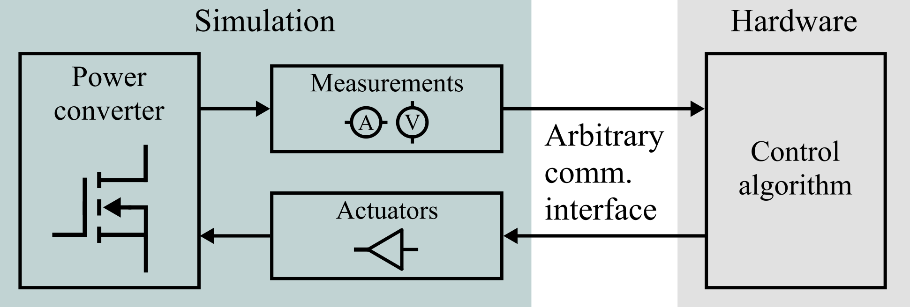
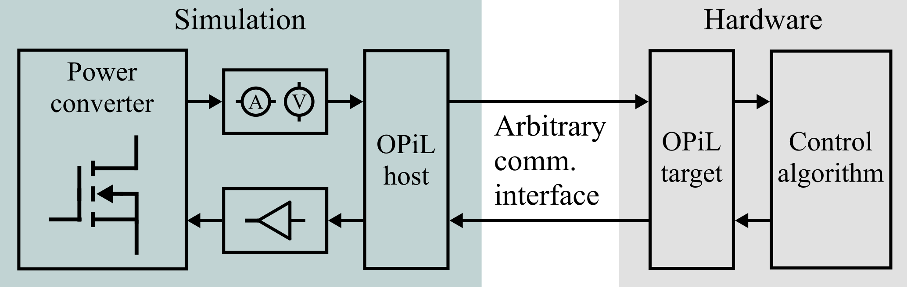

.. _sec-intro:

Introduction
=============

This section discusses how PiL works, and OPiL's design philosophy. For a quickstart guide on how to get OPiL running with PLECS, see :ref:`sec-quickstart`. For a discussion on how OPiL is implemented, and how it can be integrated to a simulation software and an embedded target, see :ref:`sec-c-implementation`. For an example of using OPiL with PLECS, and Windows to emulate a controller, see :ref:`sec-plecs-example`.

How PiL works
-------------

The main idea behind PiL is illustrated in :numref:`fig-pil`.

   
   Processor-in-the-loop (PiL) scheme.

The converter (or any system) is simulated by a simulation software. The simulation model can also include hardware components such as sensors, signal conditioning circuits, analog-to-digital converters (ADCs), pulse width modulation (PWM), etc. 

At each sampling instant, measurements are sent to the controller (the embedded target). The controller computes the control signals, and sends them back to the simulation, which then simulates the system for another step.

How OPiL works
--------------

For a PiL scheme to work, simulation and controller need to be coordinated. OPiL is a framework that coordinates the data flow between simulation and controller.  OPiL can be conceptually seen as interface blocks that are added to the simulation and target sides, as shown in :numref:`fig-pil-opil`.

   
   PiL scheme with OPiL.

The OPiL host and target blocks coordinate the data flow between simulation and controller. The host block interacts with the the simulation by reading measurements and applying control signals. These signals are sent and received to the host target block through a communication interface. On the target side, the target block interacts with the controller by sending measurements and getting control signals. The OPiL host and target blocks also have a communication interface, which allows the two sides to exchange data. 

The exact steps that the OPiL host and target blocks follow are illustrated in :numref:`fig-opil-flowchart`.

.. subfigure:: AB
   :layout-sm: AB
   :gap: 8px
   :subcaptions: below
   :name: fig-opil-flowchart
   :class-grid: outline

   .. image:: images/intro/opil-flowchart-host.png
      :scale: 15%
      :alt: Host flowchart

   .. image:: images/intro/opil-flowchart-target.png
      :scale: 15%
      :alt: Target flowchart

   Host and target flowcharts.

The OPiL framework implements the steps indicated in :numref:`fig-opil-flowchart`. Moreover, a small protocol is used to exchange data between the target and host blocks. This protocol establishes only a data packet format that is to be expected by each block. The data packets are shown in :numref:`fig-opil-data`.

.. subfigure:: A|B
   :layout-sm: A|B
   :gap: 8px
   :subcaptions: below
   :name: fig-opil-data
   :class-grid: outline

   .. image:: images/intro/opil-data-exchange-host.png
      :scale: 15%
      :alt: Host to target

   .. image:: images/intro/opil-data-exchange-target.png
      :scale: 15%
      :alt: Target to host

   Data packets sent from host to target (top), and from target to host (bottom).

The protocol always follows a size-data pattern. Before sending the data, a 4-byte unsigned integer is sent. This value represents the size of the data that follows next. This size is always in number of bytes, and a negative number may be used to signal any errors. 

In the OPiL framework, four data packets are exchanged in total. First, the host sends a measurements data packet. This packet is intended to hold measurements, such as voltage and current signals. Next, the host sends a simulation data packet, which contains additional signals such as reference signals, controller gains, etc. 

The target sends first a control data to the host. This packet is intended to hold control signals, which could be gate signals, modulation indices, etc. In addition, the target sends a controller data packet, which can hold debugging signals such as execution time, status flags, etc.

OPiL structure
--------------

OPiL requires several interfaces: an interface to the simulation, so that measurements and control signals can be read/set, an interface to the control algorithm, and an interface to a communication medium.

In order to make OPiL modular, its structure is divide in modules. The OPiL host and target blocks are divided each in three submodules, shown in :numref:`fig-opil-uml-host` and :numref:`fig-opil-uml-target`.

   
   OPiL host modules.

   
   OPiL target structure.

An imporant feature of this modular design is that it becomes straightforward to adapt PiL to different simulation tools and embedded targets. For example, migrating to a new simulation software requires changing only the ``Simulation interface`` module, while all other modules remain unchanged. Likewise, migrating to a different embedded target requires changing only the ``Controller interface`` module.

OPiL host
^^^^^^^^^

:numref:`fig-opil-uml-host` shows how OPiL host is structured. The core module is denoted as ``OPiL Host``, and it is responsible for executing the host steps shown in :numref:`fig-opil-flowchart`.

To improve modularity, ``OPiL Host`` should not be aware of the communication channel that is used to communicate with the target, nor should it be aware of the simulation software. This is achieved by using two additional modules: ``Host comm.`` and ``Simulation interface``. 

The ``Host comm.`` module provides core functionalities that allows exchanging data with the target. The core functionalities are:

#. ``connect``: allows connecting to the target. The behavior of this connection is left to be defined by the user. For example, if using a serial-based  communication channel, a connect could mean to simply open the COM port, or even request an ack signal from the target to indicate connection. 
#. ``disconnect`` allows disconnecting from the target. The behavior is also left to be defined by the user. 
#. ``send``: allows sending data to the target. This could mean directly sending the data packet, or enqueuing it in a buffer for transmission.
#. ``receive``: allows receiving data from the target. This could mean retrieveing data from a receive buffer, or requesting data from the target.

The ``Simulation interface`` module provides the core functionalities that allows interfacing with the simulation software. The core functionalities are:

#. ``updateSim``: allows updating simulation data. This could mean copying data from the simulation to internal buffers. The exact behavior depends on the simulation software.
#. ``getMeas`` allows reading measurements. This is the data that is sent in the measurements data packet, as shown in :numref:`fig-opil-data`. Depending on the simulation software, getting the measurements could simply mean accessing internal buffers with data that was already copied, or pulling the data directly from the simulation. 
#. ``getSimData``: allows getting simulation data. Its functionality and behavior is close to that of ``getMeas``.
#. ``updateControl``: allows updating control signals in the simulation. This could mean copying data to a buffer, or directly updating control signals in the simulation.
#. ``updateControllerData``: allows updating controller data. Its functionality and behavior is close to that of ``updateControl``.
#. ``applyControl``: allows applying the control signals in the simulation.

OPiL target
^^^^^^^^^^^

:numref:`fig-opil-uml-target` shows how ``OPiL target`` is structured. The core module is denoted as ``OPiL Target``, and it is responsible for executing the target steps shown in :numref:`fig-opil-flowchart`.

The structure of ``OPiL Target`` is very similar to that of ``OPiL Host``. ``OPiL Target`` contains a communication module and a controller interface. 

The ``Target comm.`` module provides core functionalities that allows exchanging data with the host, which are:

#. ``connect``: allows connecting to the host. The behavior of this connection is left to be defined by the user. For example, if using a serial-based  communication channel, a connect could mean to simply send an ack signal when requested, to signal that the target is connected and its communication port is open.
#. ``disconnect`` allows disconnecting from the target. The behavior is also left to be defined by the user. 
#. ``send``: allows sending data to the host. This could mean directly sending the data packet, or enqueuing it in a buffer for transmission.
#. ``receive``: allows receiving data from the host. This could mean retrieveing data from a receive buffer, or requesting data from the target.

The ``Controller interface`` module provides core functionalities that allows interfacing with the controller, or control algorithm. The core functionalities are:

#. ``updateMeas``: allows updating the measurements in the controller. This could mean copying data to internal buffers inside the controller. The exact behavior depends on how the controller is implemented.
#. ``updateSimData`` allows updating simulation data in the controller. Its functionality and behavior is close to that of ``updateMeas``.
#. ``initControl``: allows initializing the controller. Its exact behavior depends on how the controller is implemented. This could be used, for example, to reset the controller's states whenever a new simulation is started (e.g. on a new connection).
#. ``runControl``: allows running the control algorithm.
#. ``getControl``: allows getting the control signals, computed by the control algorithm.
#. ``getControllerData``: allows getting additional controller signals that can be used for benchmarking, debuggind and monitoring.

.. raw:: html

    

This section provided a conceptual discussion on how the OPiL framework is designed. For a quickstart guide on how to get OPiL running with PLECS, see :ref:`sec-quickstart`. For a discussion on how OPiL is implemented, and how it can be integrated to a simulation software and an embedded target, see :ref:`sec-c-implementation`. For an example of using OPiL with PLECS, and Windows to emulate a controller, see :ref:`sec-plecs-example`.
