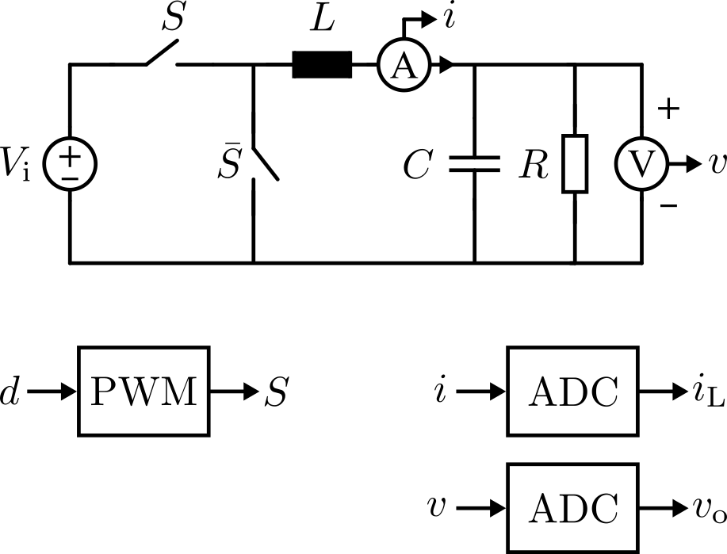
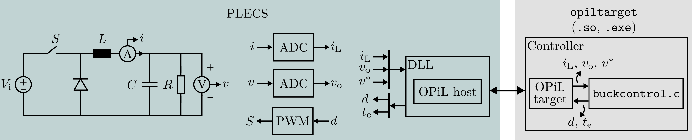
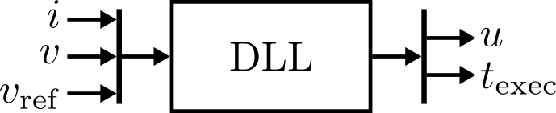
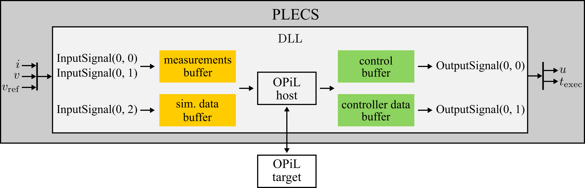

.. _sec-plecs-example:

PiL example with PLECS
======================

This sections shows an example of running a PiL scheme with OPiL. In this example, a buck converter is simulated with PLECS, and the host machine is used as the embedded controller (that is, the same machine running PLECS).

.. note::
   
   Although the controller is emulated in the host machine, using an actual embedded target is just a matter of using a target with Ethernet, and implementing the communication interface for the target. The control algorithm and the controller interface remain exactly the same.

Model
-----

The simulation model consists of a buck converter, a PWM modulator, voltage and current sensors, and ADCs. From the controller's perspective, the converter can be seen as a system that takes as input the duty-cycle, and gives voltage and current measurements as outputs. A diagram of the model is shown in :numref:`fig-plecs-example-buck-model`, where the input to the system is the duty-cycle :math:`d`, and the outputs are the measurements :math:`i_\text{L}` and :math:`v_\text{o}`

   
   Buck model used for PiL example.

Controller
----------

A state-feedback controller is used to control the converter. The control law :math:`d[k]` is given by

.. math::
   
   d[k] = k_\text{r}v^* - k_\text{i}i_\text{L} - k_\text{v}v_\text{o},

where :math:`v^*` is the reference, :math:`i_\text{L}` is the inductor current, :math:`v_\text{o}` is the output voltage, and :math:`k_\text{r}`, :math:`k_\text{i}` and :math:`k_\text{v}` are controller gains. 

The controller can be seen as a system that takes as inputs the reference, inductor current and output voltage, and gives a duty-cycle as output.

Diagram of PiL system
---------------------

A diagram of the PiL scheme used in this example is shown in :numref:`fig-plecs-example-pil-diagram`. The left side of the image shows what is inside the PLECS model. PLECS simulates the converter (power stage), as well as signal acquisition (sensors and ADCs) and actuation (PWM). The data is sent to a DLL block that runs the ``OPiL host`` module. The right side of the image shows the controller, which consists of the ``OPiL target`` module, and a ``buckcontrol.c`` source file. The source file is where the control law is executed.

   
   Diagram of the PiL scheme.
   
Communication
-------------

Networks sockets are used as the communication medium. 

Running OPiL host in PLECS
------------------------------

``OPiL host`` must be executed by PLECS, which requires an interface between them. Interfacing ``OPiL Host`` with PLECS simply means providing ``OPiL Host`` with ways that allow getting and updating signals on PLECS' environment. 

In PLECS, this is achieved by using the ``DLL`` block. A complete description of how this block works is available in the official PLECS documentation. The DLL block can be viewed just like any regular block, containing inputs and outputs. However, this block allows interfacing with an external DLL. Thus, this block is used as the interface between PLECS and ``OPiL host``. The block  will not be explained in detail here, but rather how it is used.

As mentioned in the :ref:`sec-c-implementation-example-simif` section, the simulation interface needs to know where the data (measurements, simulation data, control signals, and controller data) are in the simulation. This is achieved by creating buffers in the ``OPiL host`` application, which will hold these signals. Everytime the DLL block is executed, all inputs to the block (which are the measurements and simulation data) are copied to these buffers, and OPiL is executed. After execution, the output data (control and controller data) are copied to the output buffers automatically by OPiL, and the DLL block can read from these buffers and apply the signals as outputs of the block.

This idea is illustrated at a higher level in :numref:`fig-plecs-example-plecs-dll-principle`, and at a lower level in :numref:`fig-plecs-example-plecs-dll-principle-low-level`. 

   
   DLL in PLECS.

:numref:`fig-plecs-example-plecs-dll-principle` shows an example of a DLL block containing three input: two inputs are measurements (``i`` and ``v``); and one inputs is additional simulation data (``v_ref``). The block contains two outputs: the control signal (``u``) and additional controller data (``t_exec``).

:numref:`fig-plecs-example-plecs-dll-principle-low-level` shows what happens inside the DLL block, at a lower level. At every sampling instant, the input signals of the DLL block are copied to internal buffers. These buffers are read by ``OPiL host``, and sent to the target through its communication interface. When ``OPiL host`` gets the control signals and controller data from the target, it copies them to the output buffers. These output buffers are used to update the output signals of the DLL block. This is how ``OPiL host`` accesses and updates data in the simulation side.

   
   Using the DLL to interface PLECS and OPiL host.

The DLL block is configured to have a sample time according to the sampling frequency of the controller. This  is not necessarily the same time step as the simulation, since the simulation may run with a variable step size. However, the DLL  block is configured to execute with a regular sample time, since a digital controller would also run in such way.

The code used to generate the DLL is specific to PLECS, since it must follow the rules of the software. The implementation for PLECS can be found in the folder ``sw/plecs`` of the ``OPiL`` project. 

Running OPiL target
-----------------------

``OPiL target`` is executed by the embedded target. In this example, the host machine is used to emulate the embedded target, and an executable file that runs ``OPiL target`` is created from a C program. In this C program, ``OPiL target`` is initialized and executed in an infinite loop.

The |buck_example_main_c| file located in ``examples/buck/src`` folder shows the ``main`` function of the C program used in this example.

First, the controller interface is initialized, in line 24. Then, ``OPiL target`` is initialized in lines 27-44, where the proper callbacks are set. These callbacks provide interfaces to the controller and for communication.

The ``while(1)`` loop executes ``OPiL target``. In this example, ``opiltargetConnectToHost`` is called (line 55), which blocks execution until a connection is received from the host. When a connection is received, ``opiltargetExchangeDataHost`` can be executed, which is responsible for executing the state machine of ``OPiL target``, where data is received from the host, the controller is executed, and data is sent back (line 59). This is executed until a disconnection is detected. After disconnection, the connection is closed on the target side, by calling ``opiltargetDisconnectFromHost`` (line 64). 

Interfacing OPiL target and the controller
----------------------------------------------

``OPiL target`` and the controller are interfaced through the controller interface (see :ref:`sec-c-implementation-ctlrif`).

The actual controller is implemented in the |buckcontrol_h| and |buckcontrol_c| files, also located in ``examples/buck/src``.

During initialization of ``OPiL target``, the two functions defined in |buckcontrol_h| are given as parameters to the controller interface (see line 24 in |buck_example_main_c|). Note that these functions have the signature defined by the controller interface (see |ctlrif_h|).

The ``initialize`` function is called once when ``OPiL target`` receives a new connection, which means that a new simulation is about to start. This can be used to initialize the controller. In this example, the initialize function is just used to print some debug information to the console.

The ``control`` function is called once everytime when ``OPiL target`` receives new measurements and simulation data. The control algorithm should be implemented in this function. The ``control`` function receives four pointers. The first two pointers, denoted as ``ms`` and ``sd`` in |buckcontrol_h|, indicate where the measurements and simulation data are located at. These pointers should be read-only. Inside the controller function, they are cast to ``stypesMeasurements_t`` and ``stypesSimData_t`` types (see line 75 and 76 of |buckcontrol_c|). The other two pointers, denoted as ``ctl`` and ``ctlrdata``, indicate where the control signals and controller data should be written to. These pointers should be write-only. Inside the controller function, they are cast to ``stypesControl_t`` and ``stypesControllerData_t`` types (see line 77 and 78 of |buckcontrol_c|).

