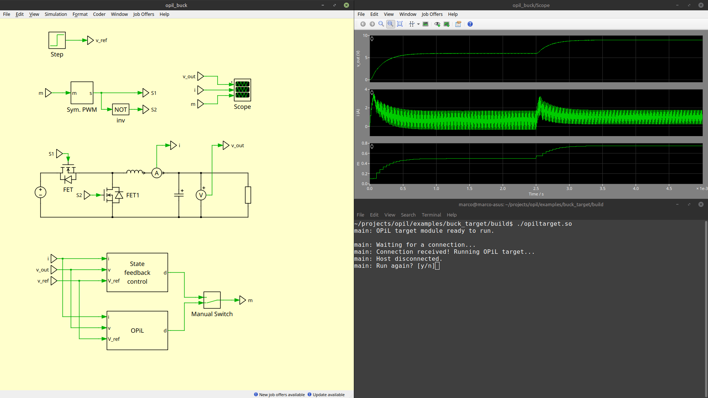

.. _sec-quickstart:

Quickstart guide
================

This section contains a quickstart guide on how to get OPiL running in PLECS and how to implement your own models. For a more complete  discussion on how this example works, and how it can be adapted to new models, see :ref:`sec-plecs-example`.

.. note::
   
   The example provided in this guide uses the host machine to emulate the embedded controller. Running this example on an actual controller requires only implementing the communication interface on the embedded target. See :ref:`sec-c-implementation-running-opil-target` for a discussion on how to run ``OPiL target`` on an embedded target.
   
Requirements
------------ 

#. PLECS
#. Make
#. A C compiler

Running on Windows
^^^^^^^^^^^^^^^^^^

If you're using Windows, we recommend you install ``make`` and the GCC compiler using `MSYS 2 <https://www.msys2.org/>`_. Make sure the compiler matches your PLECS version, e.g. if your PLECS is 64 bits, you must use a 64 bit compiler.

Install `MSYS 2 <https://www.msys2.org/>`_ following the instructions on the website. After installing the compiler, install ``make`` with

.. code-block:: console

   pacman -S make

After installation completes, don't forget to add MSYS and ``make`` to your Windows environment variables. It is necessary to add both the path to the compiler and to make, i.e.

- `C:\\msys2\\ucrt64\\bin`
- `C:\\msys2\\usr\\bin`

Make sure you add them in this order.

Running OPiL
------------

The easiest way to get OPiL running is to run the example provided in the `project's official repository <https://gitlab.rhrk.uni-kl.de/lrs/opil>`_. The example shows how to use PLECS to simulate a buck converter and the host machine to emulate the embedded controller.

Building and running
^^^^^^^^^^^^^^^^^^^^

With the command prompt, navigate to the ``examples/buck`` folder, found in the project's root directory. Once inside the folder, run the ``make`` command. The result should look something like the following: 

.. code-block:: console
   
   $ opil/examples/buck$ make
   make -f ../../sw/plecs/make_opil_plecs.mk BUILD_DIR=plecs/build OPIL=../.. HOST_COMM_SOCK_SERVER_IP=127.0.0.1 HOST_COMM_SOCK_SERVER_PORT=8090
   make[1]: Entering directory '~/opil/examples/buck'
   mkdir -p plecs/build
   gcc -fPIC -O2  -c ../../comm/linux/hostCommSock.c -I../../comm/ -I../../ -o plecs/build/hostCommSock.o -DHOST_COMM_SOCK_SERVER_IP=\"127.0.0.1\" -DHOST_COMM_SOCK_SERVER_PORT=8090
   gcc -fPIC -O2  -c ../../simif/simif.c -I. -I../../ -o plecs/build/simif.o
   gcc -fPIC -O2  -c ../../opilhost.c -o plecs/build/opilhost.o
   gcc -fPIC -O2  -c ../../sw/plecs/opil_plecs.c -I. -I../../ -o plecs/build/opil_plecs.o
   gcc -L. -Wl,-rpath=. -shared -o plecs/build/libopil_plecs.so plecs/build/opil_plecs.o plecs/build/hostCommSock.o plecs/build/simif.o plecs/build/opilhost.o
   make[1]: Leaving directory '~/opil/examples/buck'
   make -f make_ctrl.mk BUILD_DIR=build OPIL=../.. TARGET_COMM_SOCK_SERVER_PORT=8090
   make[1]: Entering directory '~/opil/examples/buck'
   mkdir -p build
   gcc -O2 -c ../../ctlrif/ctlrif.c -I../../ -I. -o build/ctlrif.o
   mkdir -p build
   gcc -O2 -c ../../comm/linux/targetCommSock.c -I../../ -I../../comm/ -o build/targetCommSock.o -DTARGET_COMM_SOCK_SERVER_PORT=8090
   mkdir -p build
   gcc -O2 -c ../../opiltarget.c -I../../ -o build/opiltarget.o
   mkdir -p build
   gcc -O2 -c src/buckcontrol.c -I../../ -I. -o build/buckcontrol.o
   gcc -O2 -c src/main.c -I../../ -o build/main.o
   gcc build/main.o build/ctlrif.o build/targetCommSock.o build/opiltarget.o build/buckcontrol.o -o build/opiltarget.so
   make[1]: Leaving directory '~/opil/examples/buck'

Once ``make`` is executed, a folder called ``build`` is created. The ``make`` command creates an executable file, called ``opiltarget.exe`` or ``opiltarget.so``. On Windows, you can double-click this file to execute it. After executing the program a new window should pop-up, with the following message:

.. code-block:: console
   
   main: OPiL target module ready to run.
   
   main: Waiting for a connection...

Now, the target is running, and waiting for new connections. 

Inside ``examples/buck`` is a folder called ``plecs``. Inside it, there's a PLECS file, which contains the simulation model for this example. Open this file and run the simulation. The result should be as in :numref:`fig-quickstart-example-run`. 

   
   Successful execution of OPiL.

The code executed by the controller is in the ``examples/buck/src/buckcontrol.c`` file. 

Running your own models
-----------------------

To run your own models, it is necessary to properly set PLECS, the OPiL framework, and the controller. This sections explains the necessary step for each one. The steps can be summarized as:

- Setting the inputs and outputs of the DLL block in the PLECS model.
- Defining measurements, simulation data, control and controller data signals in the OPiL framework (the `stypes.h` file).
- Setting the IP address and port of the target in the host communication module of the OPiL framework.
- Implementing ``initialize`` and ``control`` functions for the controller.
- Setting the port in the target communication module of the OPiL framework.

For your projects, we recommend using the same folder structure provided in the example. Then, all the make files are ready to use.

PLECS
^^^^^

Running OPiL with PLECS requires a DLL block containing the DLL that runs the ``OPiL host`` module. The inputs to this block are the measurements and simulation data to be sent to the controller, and the outputs are the control signals and controller data that are sent back from the controller. These signals are multiplexed into the DLL, and must follow the same order as they are defined in the `stypes.h` file (more on this later). It is also important to define the sampling time of the DLL. This corresponds to the execution period of the controller.

In the provided example, there are three signals that are sent to the controller: a current measurement, a voltage measurement and a reference voltage. Two signals are expected to be received from the controller: the duty-cycle, and the execution time of the control algorithm. In the example, the DLL containing the ``OPiL host`` module
is located inside the ``OPiL`` subsystem. The subsystem and the settings of the DLL block are shown in :numref:`fig-quickstart-plecs-opil-host`.

.. subfigure:: AB
   :layout-sm: AB
   :gap: 8px
   :subcaptions: below
   :name: fig-quickstart-plecs-opil-host
   :class-grid: outline

   .. image:: images/quickstart/plecs-opil-host.png
      :scale: 50%
      :alt: OPiL host module as a DLL block in PLECS.

   .. image:: images/quickstart/plecs-dll-config.png
      :scale: 50%
      :alt: DLL settings

   ``OPiL host`` module as a DLL in PLECS, and the DLL settings.

OPiL framework
^^^^^^^^^^^^^^

After setting the inputs and outputs of the DLL block, the next step is to define these signals in the OPiL implementation.  These signals are defined as C structures in the |buck_example_stypes_h| file found in the example's folder. 

In this file, four structures corresponding to measurements, simulation data, control signals and controller data are defined. 

.. note::
   
   It is important that the order in which the variables are defined is the same as the inputs of the DLL block in the PLECS model. For example, the structure ``stypesMeasurements_t`` has two elements, ``i`` and ``v``. The signals that are multiplexed into the DLL block (see :numref:`fig-quickstart-plecs-opil-host`) must follow the same order.

The last step is to set the IP address and port of the target. There are two ways to set this. Either hard-coding it in the ``Makefile`` of the project or setting it when calling the Makefile. 

.. note:: 

   In the example, there are three make files: ``Makefile``, ``make_opil_plecs.mk``, and ``make_ctrl.mk``. The make file responsible for generating the DLL used by PLECS is the ``make_opil_plecs.mk`` file. The ``make_ctrl.mk`` is the make to generate the controller for the example. For convenience, a single ``Makefile`` was created that calls the mentioned make files. If the controller was running on a remote target, only the ``make_opil_plecs.mk`` file would be necessary.

.. note:: 

   When creating your own models, it is important to set the directory of the OPiL project, so that when running ``make``, OPiL can be found. This can be set either by editing ``Makefile`` or when running it.

Controller
^^^^^^^^^^

Setting the controller depends on the target used. In the example provided, the host machine is used to emulate the controller. The ``OPiL target`` is initialized and executed in the |buck_example_main_c| file, found in the ``examples/buck/src`` folder. The control algorithm is set during this initialization (see line 24 |buck_example_main_c|), which requires that two controller functions are implemented: an initialization function and a control function.

An example of how to implement these functions and their signature is found in the |buckcontrol_c| and |buckcontrol_h|  files. The ``initialize`` function is executed once when ``OPiL target`` receives a new connection, and the ``control`` function is executed once when new measurements and simulation data arrive from the host (simulation).

Implementing your own controller requires implementing initialization and control functions, with the same signature as shown in |buckcontrol_h|.

The last step is to set the communication module, which just requires defining the port where ``OPiL target`` will run. For the example provided, this is automatically set when compiling the code with the provided ``Makefile``.

.. raw:: html

    

This section presented a quickstart guide on how to get the example provided in the `project's official repository <https://gitlab.rhrk.uni-kl.de/lrs/opil>`_. For a more complete  discussion on how this example works, and how it can be adapted to new models, see :ref:`sec-plecs-example`.
